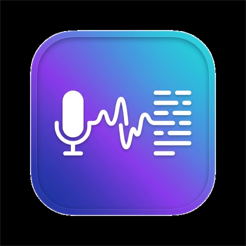

<div align="center">



# WizFlow

**Push-to-talk dictation for macOS — 100% free, 100% offline.**

Hold a key. Speak in Bangla or English. Release. Your words appear at the cursor.

[](.github/workflows/ci.yml)
[]()
[](LICENSE)
[](https://github.com/ggerganov/whisper.cpp)

</div>

---

WizFlow is a Wispr Flow–style dictation tool with none of the strings attached:
no API keys, no accounts, no subscriptions, no audio ever leaving your Mac.
It runs OpenAI's Whisper model locally via
[whisper.cpp](https://github.com/ggerganov/whisper.cpp) and pastes the result
into whatever app you're typing in — your editor, browser, terminal, anywhere.

## Features

- 🎙️ **Hold-to-talk** — hold Right Option (⌥), speak, release. Done.
- 🌏 **Bilingual** — speak Bangla → Bangla text, speak English → English text, auto-detected. Includes a fix for Whisper's notorious Bangla→Hindi misdetection.
- 🔁 **Translate mode** — hold Right Option + Shift, speak Bangla, get polished English text.
- ⚡ **Fast** — the model preloads *while you're speaking* and stays warm between dictations: ~1.5–3.5s per dictation instead of ~17s cold.
- 🪶 **Featherweight when idle** — ~57 MB RAM, 0% CPU. The ~600 MB speech model auto-unloads after a configurable idle period. Built for 8 GB Macs running heavy dev workloads.
- ⌨️ **Customizable hotkeys** — rebind both modes from Settings.
- 🔒 **Private by design** — everything runs on-device. Nothing is uploaded, ever.

## How it works

```
Hold hotkey ──► whisper-server preloads model (while you speak)
     │
     ▼
AVAudioRecorder ──► 16 kHz mono WAV
     │  release
     ▼
whisper.cpp (large-v3-turbo / medium) ──► transcript
     │
     ▼
Clipboard swap ──► synthetic ⌘V ──► clipboard restored
```

The Whisper model is **never resident while idle**. On the first key-press a
local `whisper-server` spawns and loads the model during your speech; it stays
warm for fast follow-up dictations, then shuts down after the idle timeout
(default 3 min) to return its RAM to the system. If the server isn't
available, WizFlow falls back to one-shot `whisper-cli`.

### Performance (Apple M1, 8 GB)

| Path | Latency after release | Idle RAM |
|---|---|---|
| Cold `whisper-cli` spawn | ~17 s | 0 |
| **Warm server (WizFlow default)** | **~1.5–3.5 s** | 0 after idle timeout |

## Installation

```bash
git clone https://github.com/<you>/wizFlow.git
cd wizFlow
./setup.sh
```

`setup.sh` installs `whisper-cpp` via Homebrew, downloads the two models
(~1.1 GB total), and builds `dist/WizFlow.app`.

Then:

1. `open dist/WizFlow.app`
2. Grant **Microphone** and **Accessibility** permissions
   (System Settings → Privacy & Security), relaunch
3. Open any app, hold **Right ⌥**, speak, release

## Usage

| Action | Result |
|---|---|
| Hold **Right ⌥** + speak | Transcribe in spoken language (Bangla/English auto) |
| Hold **Right ⌥ ⇧** + speak | Translate speech → English text |
| Menu bar → Settings | Rebind hotkeys, keep-warm duration, launch at login |

## Models

| Mode | Model | Size | Notes |
|---|---|---|---|
| Transcribe | `ggml-large-v3-turbo-q5_0` | ~574 MB | Best multilingual speed/quality balance |
| Translate | `ggml-medium-q5_0` | ~539 MB | Whisper's built-in any-language → English |

Models live in `~/Library/Application Support/WizFlow/models/` and can also be
downloaded from in-app Settings.

## FAQ

**Why not the OpenAI/Groq/Deepgram API?**
WizFlow's goal is zero cost and zero cloud. Whisper large-v3-turbo locally on
Apple Silicon is fast enough that the API buys you little.

**Does it work with languages other than Bangla/English?**
Yes — Whisper auto-detects ~100 languages. The Bangla→Hindi retry heuristic
only kicks in when auto-detect produces Devanagari.

**Why does Accessibility permission reset after I rebuild?**
The app is ad-hoc signed; each build gets a new signature. Remove + re-add
WizFlow in System Settings → Accessibility, or sign with a real identity.

**My dictation is longer than 15 seconds — is that OK?**
Yes. The encoder window is tuned to 15 s for speed; longer audio is processed
in sequential chunks automatically.

## Development

```bash
swift build                  # debug build
./scripts/build-app.sh       # release .app bundle in dist/
```

See [CONTRIBUTING.md](CONTRIBUTING.md) for project layout and guidelines.

## License

[MIT](LICENSE)
